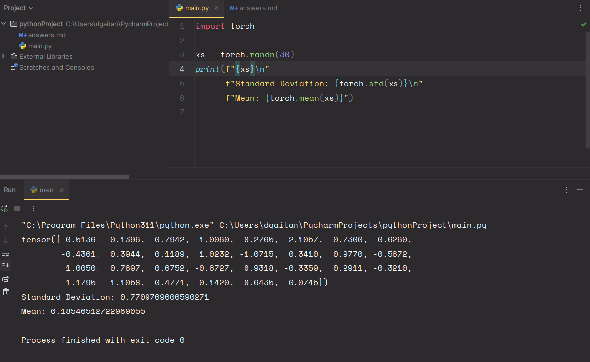

1) The program imports 'torch', a python library.
   It then assigns to a new variable a tensor with 30 random numbers.
   Every time the program runs it has to call the randn() function,
   getting a new set of random numbers.
2) The variation of the values trends towards 0 in the mean and 1 in the standard deviation however,
   it does not exactly become either of those values because there is not enough numbers to make average it out to those
   values perfectly 
3) 