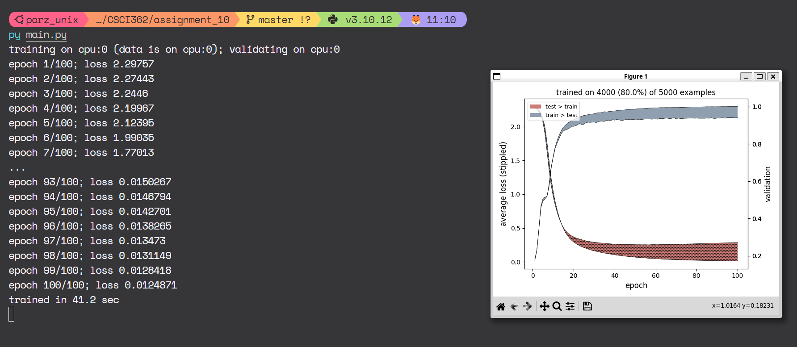
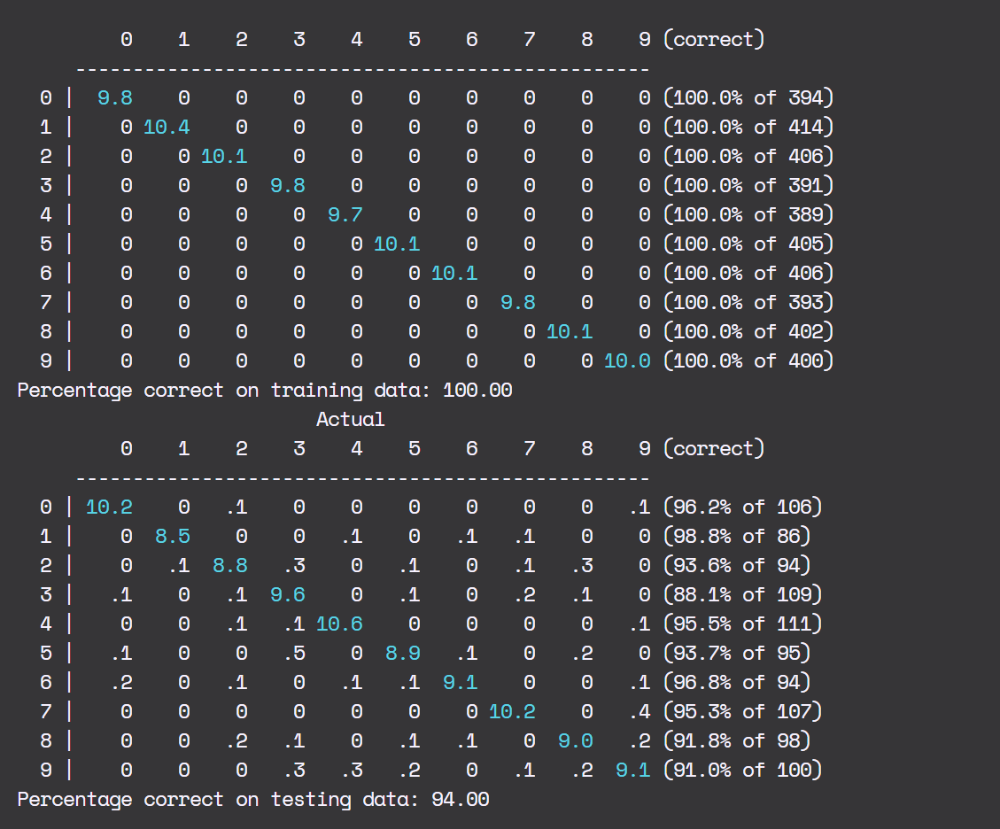

# Weights Per Layer
1. Layer 0: 400
2. Layer 1: 300
3. Layer 2: 200
4. Layer 3: 100
5. Layer 4: 10

Therefore the total amount of weights will be (counting bias): 401 * 301 * 201 * 101 * 10 
which totals to 24,503,510,010 (a lot) 